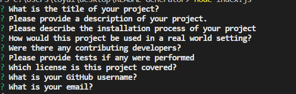

# README Generator

## Description 

This tool was created in order to automate the README creation process.

## Installation 
In order to use this tool, clone it from the github repository and open up the index.js file in node. 

https://github.com/ssangwang/README-Generator

## Usage 
This tool would be used anytime a README is needed to be created
## Questions
--GITHUB USERNAME--
ssangwang
--EMAIL--
ssangw009@umn.edu
## Tests 
No tests performed. 
## Contributing 
No contributing Developers
## License
MIT License